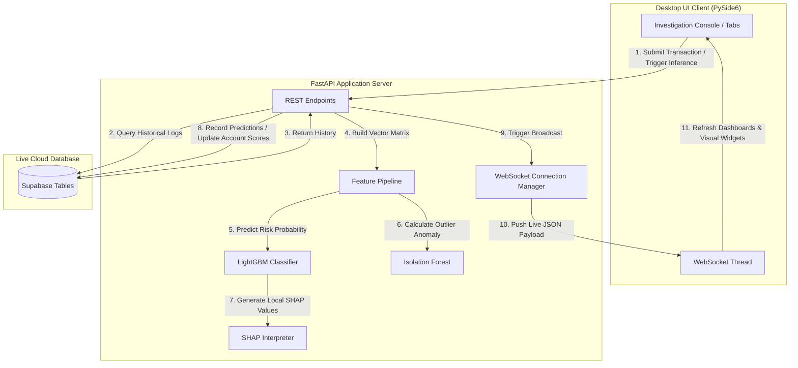
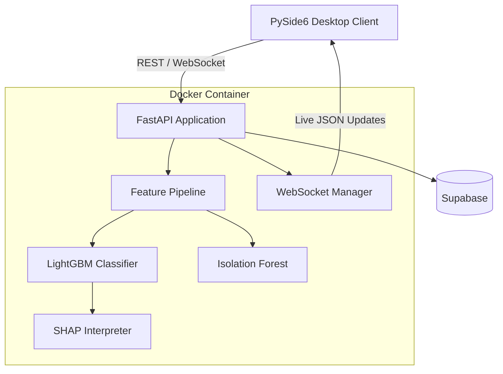

# 🛡️ MuleGuard: AI-Powered Financial Crime & Mule Account Intelligence Terminal

MuleGuard is an enterprise-grade financial intelligence terminal designed to identify, analyze, and investigate mule accounts and suspicious transaction routing in real-time. By combining a PySide6 desktop UI client with a FastAPI backend server, a Supabase live database, and machine learning classifiers (LightGBM and Isolation Forest), the terminal transforms raw transaction data into explainable risk predictions.

---

## 📐 System Data Flow

The following architecture diagram represents the lifecycle of a transaction within MuleGuard:


### 🔄 Transaction Intelligence Lifecycle

MuleGuard processes a transaction through a multi-stage intelligence pipeline:

```text
Transaction Submitted
        │
        ▼
Historical Transaction Lookup
        │
        ▼
Feature Engineering
        │
        ├── Transaction Velocity
        ├── Fan-In / Fan-Out
        ├── Amount Deviation
        ├── Bank Relationships
        ├── Transaction Timing
        └── Historical Behavior
        │
        ▼
┌─────────────────────────────┐
│       ML Risk Engine        │
├─────────────────────────────┤
│ LightGBM                    │
│ Isolation Forest            │
│ SHAP Explainability         │
└──────────────┬──────────────┘
               │
               ▼
        Risk Classification
               │
      ┌────────┼─────────┐
      ▼        ▼         ▼
   Risk     Anomaly   Explanation
   Score     Score      Factors
      │        │         │
      └────────┼─────────┘
               ▼
       Investigation Record
               │
               ▼
          Supabase DB
               │
               ▼
       WebSocket Broadcast
               │
               ▼
        PySide6 Dashboard
```

---

## 🧠 Machine Learning & Feature Engineering

MuleGuard does not rely on simple static rules. Instead, it uses a dynamic feature extraction pipeline to feed machine learning models:

### 1. Feature Engineering (`FeaturePipeline`)

The pipeline constructs high-dimensional features from a transaction and its historical context:

- **Velocity Risk (`seconds_since_previous`)**: Tracks timing frequency between sequential transfers to identify automated scripting or rapid cash-out behaviors.
- **Fan-Out Risk (`sender_unique_receivers`, `sender_unique_banks`)**: Measures how many distinct accounts or banks are receiving funds from a single source within a tight temporal window.
- **Fan-In Risk (`receiver_unique_senders`, `receiver_unique_banks`)**: Measures consolidation patterns, such as multiple distinct source accounts depositing funds into a single accumulator account.
- **Amount Deviation (`amount_diff`, `amount_ratio`)**: Computes the credit-to-debit ratio and deviation from the account holder's typical transaction amounts.
- **Transaction Context**: Evaluates bank codes (`from_bank`, `to_bank`), payment currency, transaction hour, and weekday patterns.

### 2. Risk Classification Model (`LightGBM`)

- A trained LightGBM model calculates the risk probability of a mule transaction.
- Risk probabilities are classified into standard compliance tiers:
  - **Critical** (Risk Score $\ge$ 90) $\rightarrow$ Flags account status as **Under Investigation**.
  - **High** (Risk Score $\ge$ 75) $\rightarrow$ Triggers an **Open Alert**.
  - **Medium** (Risk Score $\ge$ 40) $\rightarrow$ Restructures account status to **Monitored**.
  - **Low / Safe** (Risk Score $<$ 40) $\rightarrow$ Flags account as **Active / Normal**.

### 3. Anomaly Detection Model (`Isolation Forest`)

- An Isolation Forest model identifies multivariate outliers.
- By calculating decision path lengths in isolation trees, it isolates anomalous transactions that deviate from overall baseline historical behaviors.

### 4. Explainable AI (`SHAP`)

- Calculates local SHapley Additive exPlanations.
- The top 6 feature impacts are mapped to natural-language human explanations (e.g., explaining that the risk score is driven by *Transaction Velocity* and *Unique Senders*), allowing compliance officers to review the reasoning behind the alert.

---

## 🎯 Multi-Signal Risk Intelligence

MuleGuard combines multiple intelligence signals instead of relying exclusively on one model:

```text
                     Transaction
                          │
          ┌───────────────┼───────────────┐
          ▼               ▼               ▼
   Historical Data    Feature Engine    Context
          │               │               │
          └───────────────┼───────────────┘
                          ▼
                    ┌───────────┐
                    │ LightGBM  │
                    └─────┬─────┘
                          │
                          ▼
                    Risk Probability
                          │
                          │
                    ┌─────▼─────┐
                    │ Isolation │
                    │  Forest   │
                    └─────┬─────┘
                          │
                          ▼
                    Anomaly Signal
                          │
                          ▼
                       SHAP
                          │
                          ▼
                 Human Explanation
                          │
                          ▼
                 Investigation View
```

This architecture allows MuleGuard to distinguish between:

- High-probability mule behavior
- Unusual but potentially legitimate activity
- Historical behavioral deviations
- Rapid transaction patterns
- Account aggregation behavior
- Account dispersal behavior
- Cross-bank transaction relationships

---

## 🖥️ Desktop UI Views & Simulation Controls

The client GUI (PySide6) contains structured tabs tailored to specific investigation stages:

- **Dashboard**: High-level telemetry displaying active alerts, total tracked volumes, and real-time activity trends.
- **Active Alerts Queue**: Real-time log of flagged incidents with quick-access investigation triggers.
- **Live Transactions**: A waterfall feed showing incoming transactions with risk indicators.
- **Accounts & Transactions**: Database tabular search grids with filters.
- **Network Analysis**: Generates interactive graph layouts using NetworkX to map payment paths between counterparties.
- **Fraud Analytics**: Matplotlib line/bar/donut charts displaying month-over-month (MoM) fraud rates and categorization.
- **Regional Risk**: Geospatial risk distributions across tracking territories.
- **Payment Methods**: Donut charts, ticket volume bars, risk gauges, and detailed insights grids equipped with custom vector sparklines.

### ⚙️ Presentation Simulation Engines

For demonstration purposes, the **Fraud Analytics** and **Payment Methods** views include a `⚙️ Configure Simulation Data` tool. Analysts can override data slices, risk levels, and monthly distributions on the fly, immediately recalculating averages, percentages, and redrawing all Matplotlib figures and sparklines without backend delay.

---

## 🕸️ Transaction Network Intelligence

MuleGuard uses NetworkX-based graph analysis to represent transaction relationships between counterparties.

```text
              Account A
                  │
             ₹ 45,000
                  ▼
              Account B
              /       \
       ₹ 18,000       ₹ 22,000
          ▼               ▼
     Account C        Account D
          │               │
          └───────┬───────┘
                  ▼
             Account E
```

The network view can help investigators understand:

- Source accounts
- Destination accounts
- Intermediate accounts
- Fan-in behavior
- Fan-out behavior
- Potential aggregation accounts
- Potential dispersal accounts
- Transaction routing relationships
- Cross-bank movement patterns

---

## 📊 Risk Classification

MuleGuard converts model output into an operational risk score:

```text
Risk Score
   │
   ├── 0 ──────────────── 39
   │          LOW
   │
   ├── 40 ─────────────── 74
   │          MEDIUM
   │
   ├── 75 ─────────────── 89
   │          HIGH
   │
   └── 90 ─────────────── 100
              CRITICAL
```

| Risk Score | Risk Level | Operational Status |
|---:|---|---|
| `90 – 100` | 🔴 Critical | Under Investigation |
| `75 – 89` | 🟠 High | Open Alert |
| `40 – 74` | 🟡 Medium | Monitored |
| `0 – 39` | 🟢 Low / Safe | Active / Normal |

The risk classification is intended to support analyst prioritization and investigation workflows.

---

## 🔬 Explainable AI Investigation

MuleGuard does not only produce a risk score.

It also provides an explanation layer using SHAP.

```text
                    Model Prediction
                           │
                           ▼
                     SHAP Analysis
                           │
             ┌─────────────┼─────────────┐
             ▼             ▼             ▼
        Feature #1     Feature #2     Feature #3
             │             │             │
             ▼             ▼             ▼
       Risk Impact     Risk Impact     Risk Impact
             │             │             │
             └─────────────┼─────────────┘
                           ▼
                  Natural-Language
                     Explanation
```

Example investigation explanation:

```text
Risk Score: 92.4 — CRITICAL

Primary contributing factors:

1. High transaction velocity
2. Multiple unique receivers
3. Multiple connected banks
4. Significant amount deviation
5. Unusual transaction hour
6. Abnormal historical behavior
```

This makes the prediction easier for investigators and compliance analysts to interpret.

---

## 🗂️ Project Structure Map

| File / Directory | Target Responsibility |
| :--- | :--- |
| `backend/main.py` | FastAPI application, REST endpoints, WebSocket manager, PDF generator. |
| `backend/database.py` | Handles database connections, queries, predictions, updates, and fetches. |
| `backend/feature_pipeline.py` | Feature extraction, vector matrix builder, and transformation logic. |
| `frontend/app.py` | Primary PySide6 client codebase, widgets, Matplotlib canvas, and navigation. |
| `models/` | Serialized model pickles (`muleguard_lightgbm.pkl`, `muleguard_isolation_forest.pkl`). |
| `dist/` | Standalone packaged executable binaries for local execution. |

---

## 📦 Standalone Binaries & Reassembly

To accommodate file size limitations on GitHub, the compiled executables in the `dist/` directory are packaged into **50 MB split zip parts**.

### 📁 Binary Files Location

- **Backend Service Daemon**: `dist/main_split.zip`, `dist/main_split.z01`, `dist/main_split.z02`
- **Desktop Client Application**: `dist/app_split.zip`, `dist/app_split.z01`, `dist/app_split.z02`, `dist/app_split.z03`, etc.

### 📥 Reassembling the split files:

#### macOS / Linux

Open your terminal in the directory where the split files are saved and run:

```bash
# Reassemble and unzip the backend daemon
zip -F dist/main_split.zip --out main.zip
unzip main.zip

# Reassemble and unzip the PySide6 UI client
zip -F dist/app_split.zip --out app.zip
unzip app.zip
```

On macOS, you can also double-click `main_split.zip` or `app_split.zip` in Finder. Archive Utility will automatically locate the split parts and extract the executables.

#### Windows

Open `main_split.zip` or `app_split.zip` in archiving applications such as **7-Zip**, **WinRAR**, or **WinZip** to extract the files natively.

---

## 🌐 Connecting to your Render Backend

The client executable resolves its API endpoint dynamically. You can route transactions and risk queries to your hosted Render environment (`https://muleguard-i6ol.onrender.com`) using either of the following options:

### Method 1: Using `config.json` (Recommended)

Place a file named `config.json` next to your client executable with your Render domain:

```json
{
  "api_url": "https://muleguard-i6ol.onrender.com"
}
```

### Method 2: Via Environment Variables

Define the variable in your shell session before starting the application.

#### macOS / Linux

```bash
export MULEGUARD_API_URL="https://muleguard-i6ol.onrender.com"
./dist/app
```

#### Windows

```cmd
set MULEGUARD_API_URL=https://muleguard-i6ol.onrender.com
dist\app.exe
```

> [!IMPORTANT]
> **Render Cold-Start Performance**: Render's free tier suspends inactive containers after 15 minutes.
> The initial request will trigger a cold start taking **40-50 seconds**.
> To wake the server before opening the application, visit `https://muleguard-i6ol.onrender.com/health` in your web browser.

---

# 🐳 Docker Deployment

MuleGuard is also containerized using **Docker** to provide a consistent, portable, and reproducible runtime for the backend service.

Docker packages the FastAPI application, Python runtime, required dependencies, feature pipeline, and machine-learning inference environment into a deployable container image.

## 🏗️ Docker Architecture

The Docker deployment adds a containerization layer around the existing MuleGuard backend architecture:



### 🔧 What Docker Contains

The MuleGuard backend container contains:

- FastAPI application
- Uvicorn ASGI server
- Feature engineering pipeline
- LightGBM model
- Isolation Forest model
- SHAP explainability layer
- WebSocket connection manager
- Backend API routes
- Database integration
- Required Python libraries
- Runtime configuration

The PySide6 desktop client remains a separate application and communicates with the container through REST APIs and WebSockets.

---

## 📁 Docker Project Structure

The Docker deployment uses the following components:

```text
MuleGuard/
│
├── backend/
│   ├── main.py
│   ├── database.py
│   └── feature_pipeline.py
│
├── frontend/
│   └── app.py
│
├── models/
│   ├── muleguard_lightgbm.pkl
│   └── muleguard_isolation_forest.pkl
│
├── requirements.txt
├── Dockerfile
├── .dockerignore
└── README.md
```

### `Dockerfile`

The Dockerfile defines:

1. Base Python runtime
2. Working directory
3. Python dependencies
4. MuleGuard source files
5. ML model files
6. Backend startup command
7. Exposed application port

A typical backend Dockerfile structure is:

```dockerfile
FROM python:3.11-slim

WORKDIR /app

COPY requirements.txt .

RUN pip install --no-cache-dir -r requirements.txt

COPY backend ./backend
COPY models ./models

EXPOSE 8000

CMD ["uvicorn", "backend.main:app", "--host", "0.0.0.0", "--port", "8000"]
```

> **Note:** Keep the Dockerfile aligned with the Python version and dependency versions actually used by your MuleGuard environment.

---

## 🚫 `.dockerignore`

To keep the Docker image clean and reduce unnecessary build context, use a `.dockerignore` file.

Example:

```text
__pycache__/
*.pyc
*.pyo
*.pyd

.venv/
venv/
env/

.git/
.gitignore

.vscode/
.idea/

*.log

dist/
build/

.DS_Store

.env
```

Sensitive files such as `.env` should not be copied into the Docker image.

---

## 🔐 Environment Configuration

MuleGuard uses environment variables for sensitive configuration such as database credentials.

Example `.env`:

```env
SUPABASE_URL=your_supabase_url
SUPABASE_KEY=your_supabase_key
```

Do **not** commit the actual `.env` file to GitHub.

Instead, provide a safe template such as:

```text
.env.example
```

Example:

```env
SUPABASE_URL=
SUPABASE_KEY=
```

---

## 🐳 Build the Docker Image

From the root of the MuleGuard repository:

```bash
docker build -t muleguard-backend .
```

Docker will:

```text
Dockerfile
    │
    ▼
Base Python Image
    │
    ▼
Install Dependencies
    │
    ▼
Copy Backend
    │
    ▼
Copy ML Models
    │
    ▼
Create MuleGuard Image
```

Verify that the image exists:

```bash
docker images
```

Expected output will contain an image similar to:

```text
REPOSITORY          TAG       IMAGE ID       CREATED
muleguard-backend   latest    xxxxxxxxxxxx   ...
```

---

## ▶️ Run MuleGuard with Docker

Start the backend container:

```bash
docker run -d \
  --name muleguard-backend \
  -p 8000:8000 \
  --env-file .env \
  muleguard-backend
```

Explanation:

| Parameter | Purpose |
|---|---|
| `-d` | Runs container in detached/background mode |
| `--name` | Gives the container a recognizable name |
| `-p 8000:8000` | Maps host port 8000 to container port 8000 |
| `--env-file .env` | Loads environment variables |
| `muleguard-backend` | Docker image to run |

The FastAPI backend will then be available at:

```text
http://127.0.0.1:8000
```

Health endpoint:

```text
http://127.0.0.1:8000/health
```

---

## 🔎 Verify Docker Container

Check running containers:

```bash
docker ps
```

Check all containers:

```bash
docker ps -a
```

Inspect the container:

```bash
docker inspect muleguard-backend
```

Check container logs:

```bash
docker logs muleguard-backend
```

Follow live logs:

```bash
docker logs -f muleguard-backend
```

---

## 🧪 Test the Backend

After starting the container, verify that the FastAPI service is responding.

Open:

```text
http://127.0.0.1:8000/health
```

Or use:

```bash
curl http://127.0.0.1:8000/health
```

A successful response confirms that the containerized backend is running and reachable.

---

## 🔗 Connect PySide6 Client to Docker Backend

When the PySide6 desktop application and MuleGuard Docker backend are running on the same machine, configure the client to use:

```json
{
  "api_url": "http://127.0.0.1:8000"
}
```

### Environment Variable

#### macOS / Linux

```bash
export MULEGUARD_API_URL="http://127.0.0.1:8000"
./dist/app
```

#### Windows

```cmd
set MULEGUARD_API_URL=http://127.0.0.1:8000
dist\app.exe
```

The resulting local architecture is:

```text
┌───────────────────────────────┐
│     PySide6 Desktop Client    │
│                               │
│ Dashboard                     │
│ Alerts                        │
│ Transactions                  │
│ Network Analysis              │
│ Fraud Analytics               │
│ Regional Risk                 │
└───────────────┬───────────────┘
                │
                │ REST / WebSocket
                ▼
        ┌───────────────────┐
        │ Docker Container  │
        │                   │
        │ FastAPI           │
        │ Feature Pipeline  │
        │ LightGBM          │
        │ Isolation Forest  │
        │ SHAP              │
        │ WebSocket Manager │
        └─────────┬─────────┘
                  │
                  ▼
             Supabase
```

---

## 🔄 Rebuild After Code or Model Changes

If backend code, dependencies, or model files are updated, rebuild the Docker image.

Stop the existing container:

```bash
docker stop muleguard-backend
```

Remove it:

```bash
docker rm muleguard-backend
```

Rebuild:

```bash
docker build -t muleguard-backend .
```

Run the updated container:

```bash
docker run -d \
  --name muleguard-backend \
  -p 8000:8000 \
  --env-file .env \
  muleguard-backend
```

---

## ☁️ Production Docker Deployment

The same Docker image can be used as the backend deployment artifact for a cloud container platform.

The deployment lifecycle is:

```text
                 MuleGuard Repository
                         │
                         ▼
                   Dockerfile
                         │
                         ▼
                   Docker Build
                         │
                         ▼
                  Docker Image
                         │
                         ▼
              Container Registry /
              Cloud Container Host
                         │
                         ▼
                MuleGuard FastAPI
                         │
          ┌──────────────┼──────────────┐
          ▼              ▼              ▼
       ML Models     Supabase       WebSocket
          │              │              │
          └──────────────┼──────────────┘
                         ▼
                 PySide6 Client
```

This approach provides:

- Reproducible environments
- Dependency isolation
- Portable backend deployment
- Easier production configuration
- Consistent ML runtime
- Simplified backend scaling
- Easier deployment and rollback

---

## 🔐 Docker Security Considerations

MuleGuard handles financial transaction intelligence, so deployment security is important.

### Never commit secrets

Do not commit:

```text
.env
Supabase service keys
API keys
database passwords
private credentials
```

### Use environment variables

Production secrets should be injected through the deployment environment.

### Protect production endpoints

For production deployments, consider:

- HTTPS/TLS
- Authentication
- Authorization
- API rate limiting
- Secure WebSocket connections
- CORS restrictions
- Secret management
- Container vulnerability scanning
- Log monitoring

### Protect model files

The serialized ML models should be treated as application assets and should not expose sensitive training data or credentials.

---

## 🛑 Stop Docker Container

Stop MuleGuard:

```bash
docker stop muleguard-backend
```

Remove the container:

```bash
docker rm muleguard-backend
```

Force remove if required:

```bash
docker rm -f muleguard-backend
```

---

## 🧹 Docker Cleanup

Remove unused containers:

```bash
docker container prune
```

Remove unused images:

```bash
docker image prune
```

Remove unused Docker resources:

```bash
docker system prune
```

> [!WARNING]
> `docker system prune` removes unused Docker resources. Review what Docker reports before confirming the cleanup.

---

## 🔀 MuleGuard Deployment Modes

MuleGuard supports multiple deployment configurations:

### 1. Local Source Deployment

```text
PySide6
   │
   ▼
Local FastAPI
   │
   ▼
ML Models + Supabase
```

### 2. Dockerized Backend

```text
PySide6
   │
   ▼
Docker
   │
   ▼
FastAPI + ML Models
   │
   ▼
Supabase
```

### 3. Render Backend

```text
PySide6
   │
   ▼
Render
   │
   ▼
FastAPI + ML Models
   │
   ▼
Supabase
```

### 4. Standalone Desktop Application

```text
PySide6 Executable
        │
        ▼
Configured Backend
        │
        ├── Local Docker
        ├── Local FastAPI
        └── Render
```

This makes the desktop client flexible enough to communicate with different backend environments without changing the core investigation interface.

---

## 🚀 Launching from Source Code

### 🍎 Running on macOS

1. Activate virtual environment:

```bash
source venv/bin/activate
```

2. Start the FastAPI backend:

```bash
uvicorn backend.main:app --host 127.0.0.1 --port 8000 --reload
```

3. In a new terminal, launch the desktop app:

```bash
python frontend/app.py
```

### 🪟 Running on Windows

1. Activate virtual environment:

```cmd
venv\Scripts\activate.bat
```

2. Start the FastAPI backend:

```cmd
uvicorn backend.main:app --host 127.0.0.1 --port 8000 --reload
```

3. In a new terminal, launch the desktop app:

```cmd
python frontend/app.py
```

---

## 🧩 Running MuleGuard Using Docker

Instead of running FastAPI directly through the Python environment, the backend can be started through Docker:

```bash
docker build -t muleguard-backend .

docker run -d \
  --name muleguard-backend \
  -p 8000:8000 \
  --env-file .env \
  muleguard-backend
```

Then launch the desktop client:

```bash
python frontend/app.py
```

Configure the client to:

```text
http://127.0.0.1:8000
```

The final local setup becomes:

```text
                ┌──────────────────────┐
                │   PySide6 Client     │
                │   Investigation UI   │
                └──────────┬───────────┘
                           │
                    REST / WebSocket
                           │
                           ▼
                ┌──────────────────────┐
                │   Docker Container   │
                │                      │
                │ FastAPI              │
                │ Feature Pipeline     │
                │ LightGBM             │
                │ Isolation Forest     │
                │ SHAP                 │
                │ WebSocket Manager    │
                └──────────┬───────────┘
                           │
                           ▼
                    ┌─────────────┐
                    │  Supabase   │
                    │ Live DB     │
                    └─────────────┘
```

---

## 📌 Important Architecture Note

Docker does **not replace the MuleGuard transaction intelligence architecture**.

It provides the deployment and runtime layer around the existing FastAPI backend.

The core intelligence flow remains:

```text
Transaction
     ↓
Historical Context
     ↓
Feature Pipeline
     ↓
LightGBM ──────────→ Risk Probability
     ↓
Isolation Forest ──→ Anomaly Signal
     ↓
SHAP ──────────────→ Explanation
     ↓
Investigation Record
     ↓
Supabase
     ↓
WebSocket
     ↓
PySide6 Investigation Console
```

Docker simply packages the backend environment so that this pipeline can be executed consistently across development, testing, and production environments.

---

## 🛡️ MuleGuard at a Glance

```text
┌───────────────────────────────────────────────────────────┐
│                        MULEGUARD                          │
│       AI-Powered Financial Crime Intelligence Terminal    │
├───────────────────────────────────────────────────────────┤
│                                                           │
│  🖥️ PySide6 Desktop Investigation Console                 │
│                                                           │
│  ⚡ FastAPI Real-Time Backend                             │
│                                                           │
│  🧠 LightGBM Risk Classification                         │
│                                                           │
│  🔍 Isolation Forest Anomaly Detection                   │
│                                                           │
│  🔬 SHAP Explainable AI                                  │
│                                                           │
│  🕸️ NetworkX Transaction Network Analysis               │
│                                                           │
│  📊 Fraud & Payment Analytics                            │
│                                                           │
│  🌍 Regional Risk Intelligence                           │
│                                                           │
│  🔄 WebSocket Real-Time Updates                          │
│                                                           │
│  ☁️ Supabase Live Database                               │
│                                                           │
│  🐳 Docker Containerized Backend                         │
│                                                           │
│  📦 Standalone Desktop & Backend Binaries                │
│                                                           │
└───────────────────────────────────────────────────────────┘
```

---

## 🎯 Core Capabilities

| Capability | Implementation |
| :--- | :--- |
| Risk Classification | LightGBM |
| Anomaly Detection | Isolation Forest |
| Explainability | SHAP |
| Feature Engineering | Custom `FeaturePipeline` |
| Database | Supabase |
| Backend | FastAPI |
| Real-Time Communication | WebSockets |
| Desktop Interface | PySide6 |
| Network Analysis | NetworkX |
| Visualization | Matplotlib |
| Containerization | Docker |
| Backend Deployment | Local / Docker / Render |
| Desktop Packaging | Standalone Executables |
| Investigation Reporting | PDF Generation |

---

## 🏁 MuleGuard Deployment Summary

MuleGuard provides a complete end-to-end financial intelligence environment:

```text
                    TRANSACTION
                         │
                         ▼
                HISTORICAL CONTEXT
                         │
                         ▼
                FEATURE ENGINEERING
                         │
          ┌──────────────┼──────────────┐
          ▼              ▼              ▼
       LightGBM     Isolation Forest    Context
          │              │
          ▼              ▼
      Risk Score     Anomaly Score
          │              │
          └───────┬──────┘
                  ▼
             SHAP XAI
                  │
                  ▼
        INVESTIGATION INSIGHT
                  │
                  ▼
              SUPABASE
                  │
                  ▼
          WEBSOCKET STREAM
                  │
                  ▼
          PY SIDE6 TERMINAL
                  │
                  ▼
        ANALYST INVESTIGATION
```

MuleGuard combines **machine learning, anomaly detection, explainable AI, graph-based transaction intelligence, real-time streaming, cloud persistence, desktop investigation tooling, and Docker-based deployment** into a unified financial-crime intelligence terminal.